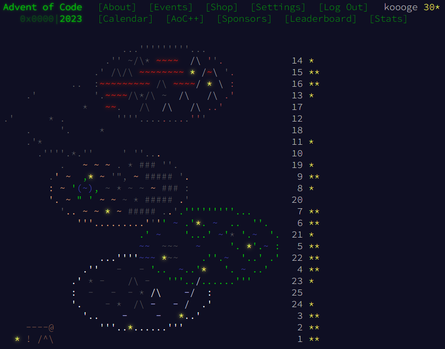

# advent-of-code/2023

Let's go rust

```sh
# create project
$ cargo new --lib day01
$ cd day01

# Edit src/lib.rs

# lint
$ cargo check
$ cargo clippy

# test
$ cargo test
$ cargo watch -x test

# test with println!
$ cargo test -- --nocapture
$ cargo watch -x 'test -- --nocapture'
```


## Achievements

