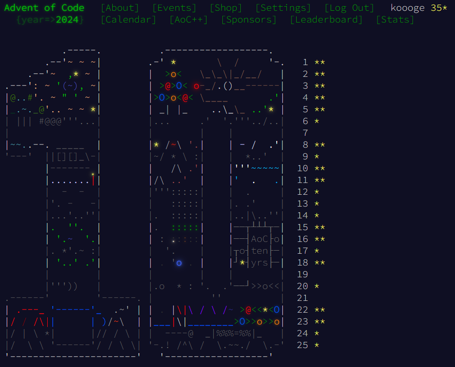

# aoc_2024
[](https://github.com/koooge/advent-of-code/actions/workflows/2024.yml)


Let's go rust

```sh
# fmt and lint
cargo check
cargo fmt
cargo clippy --all-targets --all-features -- -D warnings

# test
cargo test day01
cargo watch -x 'test day01'

# test with println!
cargo test -- --nocapture
cargo watch -x 'test day01 -- --nocapture'
```

## Achievements

